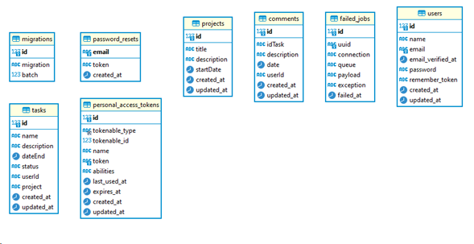

## Pasos para instalar proyecto

1. ejecutar git clone y la url del repositorio
2. ejecutar el comando composer install para instalar las dependencias del proyecto.
3. crear un archivo .env y copiar el contenido del archivo .env.example
4. ejecutar el comando php artisan migrate 
5. ejecutar el comando php artisan serve para levantar el servidor

## Documentación técnica

[Ver documentación técnica aquí.](/TaskManagement.docx)

#### Acerca del proyecto 
El proyecto se realiza bajo el lenguaje de programación PHP en su versión 8.0.6 con el framework laravel en su versión 9.52.16 usando como front end el motor de vistas Blade proporcionado por este framework con la ayuda de Bootstrap en su versión 5, este proyecto busca la gestión eficiente al momento de planificar, asignar y realizar tareas dentro de cada uno de los proyectos. 

#### Diagrama entidad relación
</img>

#### Diccionario de datos
|Tabla en DB|Nombre del campo|Tipo de campo|Comentario|
| :-------------- | :------------- | :-------------------------- | :--------- |
users|id|bigint|primary key de la tabla
users|name|Varchar(25)|Nombre del usuario
users|email|Varchar(25)|Email del usuario
users|email_verified_at|timestamp|Fecha de verificación de correo
users|password|Varchar(25)|Contraseña encriptada
users|remember_token|Varchar(100)|Confirmación de token
users|created_at|timestamp|Fecha de creación en base de datos
users|updated_at|timestamp|Fecha de actualización en base de datos
projects|id|bigint|primary key de la tabla
projects|description|Varchar(255)|Descripción del proyecto
projects|startDate|date|Fecha inicio de tarea
projects|created_at|timestamp|Fecha de creación en base de datos
projects|updated_at|timestamp|Fecha de actualización en base de datos
tasks|id|bigint|primary key de la tabla
tasks|name|Varchar(25)|Nombre de la tarea
tasks|description|Varchar(255)|Descripción de la tarea
tasks|dateEnd|date|Fecha fin de la tarea
tasks|status|varchar(255)|Estado de la tarea
tasks|userId|varchar(255)|Id del usuario
tasks|project|Varchar(255)|Id del proyecto
tasks|created_at|timestamp|Fecha de creación en base de datos
tasks|updated_at|timestamp|Fecha de actualización en base de datos
comments|id|bigint|primary key de la tabla
comments|idTask|Varchar(255)|Id de la tarea
comments|description|Varchar(255)|Descripción del comentario
comments|date|date|Fecha del comentario
comments|userId|Varchar(255)|Id del usuario
comments|created_at|timestamp|Fecha de creación en base de datos
comments|updated_at|timestamp|Fecha de actualización en base de datos

#### Arquitectura del proyecto
Se utilizó el modelo MVC como patrón de diseño tomando en cuenta que la aplicación se usará para gestionar, asignar y realizar tareas por diferentes usuarios, se hizo uso de la librería JWT para manejar todo lo relacionado con la autenticación, se hace uso de una base de datos sql (Dentro del proyecto se encuentran las migraciones para crear las tablas correspondientes.), se definen rutas web para el manejo de las vistas, acceso a controladores y demás funcionalidades existentes dentro del proyecto

